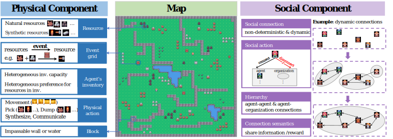
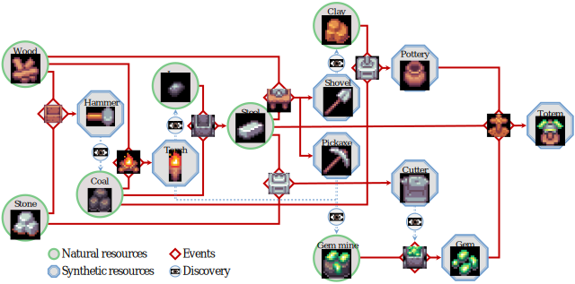

# AdaSociety



## Resources

There are 15 kinds of resources in AdaSociety, which can be divided into *Natural Resources* and *Synthesized Resources* based on whether they can be produced through events. Some of the natural resources can only be discovered and gathered by agents with certain resources (denoted by *Requirement*) in their inventories.

| Resource  | Wood | Stone | Hammer | Coal | Torch | Iron | Steel | Shovel | Pickaxe | GemMine | Clay | Pottery | Cutter | Gem | Totem |
|-----------|------|-------|--------|------|-------|------|-------|--------|---------|---------|------|---------|--------|-----|-------|
| Synthesized | :x: | :x: | :heavy_check_mark: | :x: | :heavy_check_mark: | :x: | :heavy_check_mark: | :heavy_check_mark: | :heavy_check_mark: | :x: | :x: | :heavy_check_mark: | :heavy_check_mark: | :heavy_check_mark: | :heavy_check_mark: |
| Requirement | None | None | - | Hammer | - | Torch | - | - | - | Pickaxe | Shovel | - | - | - | - |
| Objective reward | 1 | 1 | 5 | 2 | 20 | 3 | 30 | 100 | 150 | 4 | 4 | 40 | 100 | 200 | 1000 |

## Events

There are 9 built-in events in AdaSociety. Each event takes 2 to 3 kinds of resources as input and outputs 1 kind of product. Events can only be observed and executed by agents whose inventories meet the event requirements.

| Event | Input1 | Input2 | Input3 | Output | Requirement1 | Requirement2 |
|-------|--------|--------|--------|--------|--------------|--------------|
| HammerCraft | 1Wood | 1Stone | - | 1Hammer | - | - |
| TorchCraft | 1Wood | 1Coal | - | 1Torch | Coal | - |
| SteelMaking | 1Iron | 1Coal | - | 1Steel | Iron | - |
| Potting | 2Clay | 1Coal | - | 1Pottery | Clay | - |
| ShovelCraft | 2Steel | 2Wood | - | 1Shovel | Steel | - |
| PickaxeCraft | 3Steel | 2Wood | - | 1Pickaxe | Steel | - |
| CutterCraft | 2Steel | 3Stone | - | 1Cutter | Steel | - |
| GemCutting | 1GemMine | - | - | 1Gem | Cutter | GemMine |
| TotemMaking | 2Gem | 1Pottery | 1Steel | 1Totem | Gem | - |



## Inventories

Every agent has an inventory with maximal capacities of every resource, implying skill diversity. For example, an agent with a $0$ capacity for hammers cannot possess hammers and observe coal. Agents can collect resources from the map into their inventories and dump resources on the map. Agents' rewards are attached to the resources in their inventories, while they exhibit heterogeneity in resource preferences. Specifically, for agent $i$, the reward of resource $\rho$ is $R_i(\rho) = m_i^{\rho} \cdot h_i(\rho) \cdot \overline{r}^{\rho}$, where $m_i^{\rho}$ is the amount of resource $\rho$ in $i$'s inventory, $h_i(\rho) \in \mathbb{R}$ represents $i$'s preference for $\rho$, $\overline{r}^{\rho}$ is the objective reward of a unit of $\rho$

## Customization

| Element | Parameter | Description |
|---------|-----------|-------------|
| Mapsize | $h, w$ | Map height and map width. |
| Terrain | $B$ | Terrain set $B=\{b_1, \cdots, b_{\|B\|}\}$. $b_i$ represents a block. |
|         |          | $b_i^{pos}$: the position of block $b_i$ on the map which can be assigned or randomly generated. |
| Resource | $\varrho$ | Set of resources $\varrho = \{\rho_1, \cdots,\rho_{\|\varrho\|}\}$. Each resource $\rho_i$ has an attribute $\rho_i^{req}$. |
|          |            | $\rho_i^{req}$: Necessary resources in agents' inventories to observe \& collect $\rho_i$. |
|          | $\rho_{temp}$ | Temporary resources (Defined by specifying $\rho_{temp}^{req}$) |
| Event | $\mathcal{E}$ | Set of events $\mathcal{E}=\{\epsilon_1, \cdots, \epsilon_{\|\mathcal{E}\|}\}$. Each event $\epsilon_i$ has attributes $\epsilon_i^{in}, \epsilon_i^{out}, \epsilon_i^{req}$. |
|       | $\epsilon_i^{in}$ | Resources consumed by event $\epsilon_i$. |
|       |  $\epsilon_i^{out}$ | Resources produced by event $\epsilon_i$. |
|       |  $\epsilon_i^{req}$ |  Necessary resources in agents' inventories to observe \& execute $\epsilon_i$. |
|       | $\mathcal{E}^{pos}$ | Event positions $\mathcal{E}^{pos} = \{\epsilon_1^{pos}, \cdots, \epsilon_{\|\mathcal{E}\|^{pos}}\}$. Each $\epsilon_i^{pos}$ represents a list of positions of $\epsilon_i$. |
|       | $\epsilon_{temp}$ | Temporary events (Defined by specifying $\epsilon_{temp}^{in}, \epsilon_{temp}^{out}, \epsilon_{temp}^{req}$) |
| Agent | $P$ | Set of agents $P=\{1, \cdots, \|P\|\}$ |
|       | $m_i(0)$ | Initial inventories. $m^{\rho}_i(0)$ denotes the initial number of resource $\rho$ in inventories. |
|       | $i^{cap}$ | Inventory capacity. $i^{cap}$: $\varrho\to\mathbb{R}$ denotes maximum quantities of resources $i$ can carry. |
|       | $h_i$ | $h_i$: $\varrho\to\mathbb{R}$ denotes quantities of credits $i$ gets by acquiring resources. The actual reward obtained by $i$ is $h_i$ multiplied by the objective reward of the resource.|
|       | $i^{pos}(0)$ | Initial positions of agents which can be predefined or generated randomly. |

## Example Usage

### Basic

Run PPO in *Exploration*:

```shell
python rllib_train.py \
    --task basic \
    --size 20  \
    --obs_range 2 \
    --gnn \
    --algo PPO \
    --gamma 0.99 \
    --lr 1e-4 \
    --terminated_point 500 \
    --num_rollout_workers 8 \
    --num_envs_per_worker 4 \
    --rollout_fragment_length 250 \
    --sgd_minibatch_size 4096 \
    --save_interval 1000 \
    --share
```

Run Rainbow in *Contract-hard*:

```shell
python rllib_train.py \
    --task contract_complex \
    --size 15 \
    --obs_range 2 \
    --terminated_point 200 \
    --group_num 8 \
    --gnn \
    --algo Rainbow \
    --gamma 0.99 \
    --lr 1e-4 \
    --grad_clip 50.0 \
    --num_rollout_workers 8 \
    --num_envs_per_worker 1 \
    --rollout_fragment_length 240 \
    --save_interval 200 \
    --sgd_minibatch_size 2048 \
    --share \
    --contract_exploration_stage 3 \
```

Run RecPPO in *Contract-easy*:

```shell
python rllib_train.py \
    --task contract \
    --size 7  \
    --obs_range 3 \
    --gnn \
    --lstm \
    --algo PPO \
    --gamma 0.99 \
    --lr 1e-4 \
    --num_rollout_workers 8 \
    --num_envs_per_worker 2 \
    --rollout_fragment_length 120 \
    --sgd_minibatch_size 2048 \
    --save_interval 100 \
    --contract_exploration_stage 3
```

### Advanced

To customize an environment that contains new combinations of resources, events and player heterogeneity, please implement a new argument file. Please check an example in `project/advanced_args.py`.
